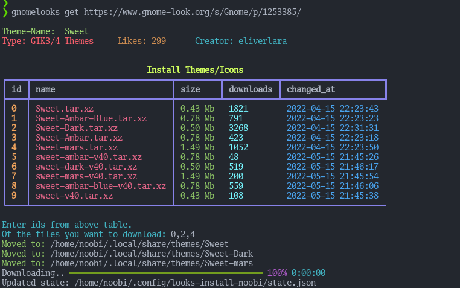

# Gnome-looks themes cli downloader

**A cli-tool to install and update gnome based Icons, GTK, Cursor themes easily**

### Supported desktop environments

- **Gnone**
- **Xfce**
- **KDE Plasma**

## gnomelooks

- To Install themes for current user
        
        gnomelooks get [THEME-URL]

- To Install themes globally

        sudo gnomelooks get [THEME-URL]

### Installation

    pip3 install -U gnomelooks

## gnomelooks help Page

    ~$ gnomelooks --help
        Usage: gnomelooks [OPTIONS] COMMAND [ARGS]...

        Theme Installer for Gnome, Xfce4, Kde 

        Options:
        --install-completion  Install completion for the current shell.
        --show-completion     Show completion for the current shell, to copy it or
                                customize the installation.
        --help                Show this message and exit.

        Commands:
        askenv  | ask deskenv
        get     | Install new UI themes/icons
        ls      | List installed themes and icons
        rm      | Remove installed themes and icons
        update  | Update installed themes and icons via this tool

## update all themes and icons

Run: `gnomelooks update --themes`
